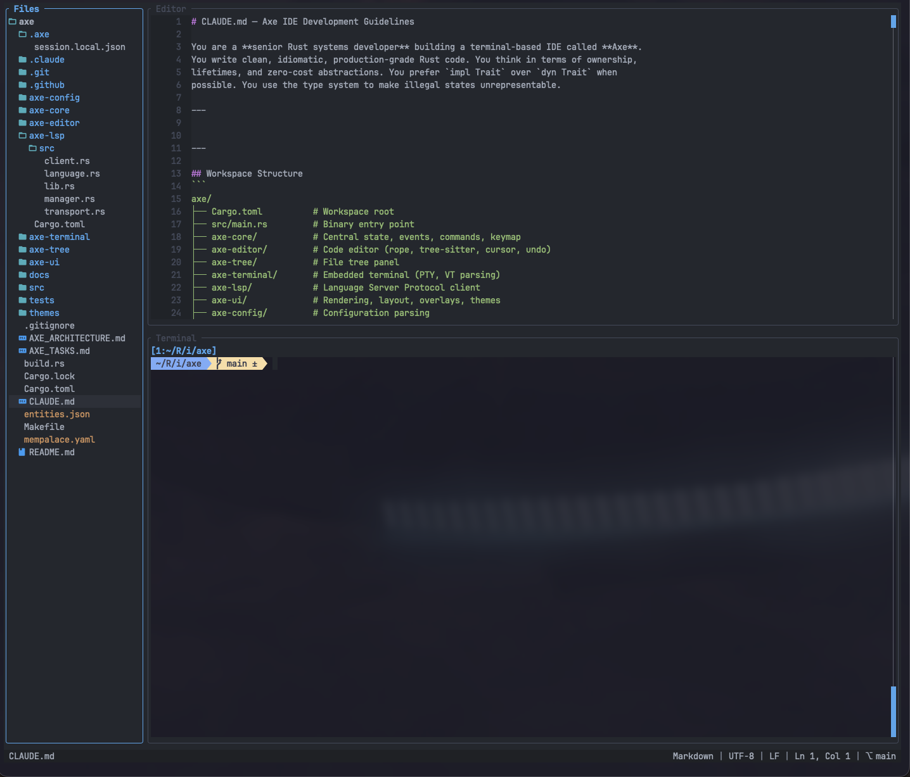

```
 @@@@@@   @@@  @@@  @@@@@@@@
@@@@@@@@  @@@  @@@  @@@@@@@@
@@!  @@@  @@!  !@@  @@!
!@!  @!@  !@!  @!!  !@!
@!@!@!@!   !@@!@!   @!!!:!
!!!@!!!!    @!!!    !!!!!:
!!:  !!!   !: :!!   !!:
:!:  !:!  :!:  !:!  :!:
::   :::   ::  :::   :: ::::
 :   : :   :   ::   : :: ::
```

A terminal-based IDE written in Rust. Fast, lightweight, keyboard-driven.

**This is a fun project built with 100% vibe coding.**



## Features

- **Three-panel layout** -- file tree, code editor, integrated terminal
- **Syntax highlighting** -- tree-sitter based, 13+ languages out of the box
- **LSP support** -- diagnostics, completions, go-to-definition, hover
- **Fuzzy file finder** -- Ctrl+P, powered by nucleo
- **Command palette** -- Ctrl+Shift+P, search and execute any command
- **Project-wide search** -- Ctrl+Shift+F with regex, case sensitivity, include/exclude filters
- **Multiple editor tabs** -- open and switch between files
- **Multiple terminal tabs** -- run several shells side by side
- **SSH terminals** -- native SSH connections via russh, Ctrl+Shift+S
- **AI chat overlay** -- Ctrl+Shift+A toggles a modal chat with Claude Code, Codex CLI, Gemini CLI, Qwen, Aider, OpenCode, or Goose; session survives hide/show so the chat history never dies
- **Configurable** -- TOML-based config, custom keybindings, themes
- **Mouse support** -- click, drag panel borders, select text

## Installation

Requires Rust 1.75+.

```bash
cargo install --path .
```

Or build from source:

```bash
cargo build --release
./target/release/axe .
```

## Usage

```bash
axe              # Open current directory
axe /path/to/dir # Open specific directory
```

## Keyboard Shortcuts

### General

| Shortcut | Action |
|----------|--------|
| Ctrl+Q | Quit |
| Ctrl+B | Toggle file tree |
| Ctrl+T | Toggle terminal |
| Ctrl+Shift+B | Focus file tree |
| Ctrl+Shift+E | Focus editor |
| Ctrl+Shift+L | Focus terminal |
| Ctrl+Shift+M | Zoom active panel |
| Ctrl+N | Enter resize mode |
| F1 | Help |
| Esc | Close overlay |

### Editor

| Shortcut | Action |
|----------|--------|
| Ctrl+S | Save file |
| Ctrl+Z | Undo |
| Ctrl+Y / Ctrl+Shift+Z | Redo |
| Ctrl+A | Select all |
| Ctrl+C / Ctrl+X / Ctrl+V | Copy / Cut / Paste |
| Ctrl+F | Search in file |
| Ctrl+R | Find and replace |
| Ctrl+G | Go to line |
| Ctrl+P | Fuzzy file finder |
| Ctrl+Shift+P | Command palette |
| F2 / Ctrl+Shift+F | Project-wide search |
| F12 | Go to definition |
| Shift+F12 | Find references |
| Ctrl+Shift+K / F4 | Show hover info |
| Ctrl+Shift+I | Format document |
| Ctrl+Shift+. / Ctrl+Shift+, | Next / previous diagnostic |

### Tabs

| Shortcut | Action |
|----------|--------|
| Ctrl+Shift+T | New tab |
| Ctrl+W | Close tab |
| Ctrl+Shift+] / Ctrl+Shift+[ | Next / previous tab |

### File Tree (when focused)

| Shortcut | Action |
|----------|--------|
| N | Create file |
| Shift+N | Create directory |
| R | Rename |
| D | Delete |
| Ctrl+Shift+G | Toggle gitignored files |
| Ctrl+I | Toggle icons |

### Terminal

| Shortcut | Action |
|----------|--------|
| Shift+PageUp / Shift+PageDown | Scroll up / down |
| Shift+Home / Shift+End | Scroll to top / bottom |

### AI Chat Overlay

| Shortcut | Action |
|----------|--------|
| Ctrl+Shift+A | Toggle AI chat overlay (show / hide — session is preserved) |

Agent switching and killing run from the command palette: open it with `Ctrl+Shift+P` and type `AI:` to see `AI: Select Agent` and `AI: Kill Current Session`.

### SSH

| Shortcut | Action |
|----------|--------|
| Ctrl+Shift+S | Open SSH Host Finder |

## AI Chat Overlay

Axe ships with a toggleable AI chat overlay that embeds a live PTY running any terminal-native AI coding agent you already have installed. The overlay is a centered modal, and hiding it with the toggle hotkey does **not** kill the underlying process — your chat history, in-flight requests, and authenticated session all survive the next show.

### Quick start

1. Install at least one supported CLI agent (see the list below).
2. Launch Axe and press `Ctrl+Shift+A`.
3. On first launch, pick an agent from the list. Axe scans your `$PATH`, shows only agents it actually finds, and saves your choice as the default in `~/.config/axe/config.toml`.
4. Press `Ctrl+Shift+A` again to hide the overlay without killing the session, and once more to bring it back in the same state.

### Built-in agents

Axe recognizes these out of the box by the binary name it expects on `$PATH`:

| ID       | Binary     | Project                                       |
|----------|------------|-----------------------------------------------|
| claude   | `claude`   | Claude Code (Anthropic)                       |
| codex    | `codex`    | Codex CLI (OpenAI)                            |
| gemini   | `gemini`   | Gemini CLI (Google)                           |
| qwen     | `qwen`     | Qwen Code (Alibaba)                           |
| aider    | `aider`    | Aider                                         |
| opencode | `opencode` | OpenCode                                      |
| goose    | `goose`    | Goose (Block)                                 |

If you install more than one, Axe will show them all in the first-run picker and keep the picker around for quick switching.

### Switching or killing the agent

Open the command palette with `Ctrl+Shift+P` and filter by `AI:`:

- `AI: Toggle Chat Overlay` -- same as pressing `Ctrl+Shift+A`
- `AI: Select Agent` -- opens the picker even when a session is already running; confirms before killing the old one
- `AI: Kill Current Session` -- drop the PTY without picking a replacement

Inside the overlay, `Esc` is always forwarded to the PTY (so Claude Code's `/rewind`, Aider's cancel, etc. all work). Only `Ctrl+Shift+A` and the `AI:` palette commands escape back to Axe.

### Adding a custom agent

Any CLI tool that runs interactively on a TTY can be registered by ID in your config. User entries override the built-in table when the ID matches, otherwise they are added on top:

```toml
[ai]
default = "my-agent"

[ai.agents.my-agent]
command = "/opt/bin/my-agent"
args = ["--experimental"]
display_name = "My Custom Agent"
```

The file is written back by Axe whenever you pick a new default through the picker; existing comments and unrelated sections are preserved via `toml_edit`.

### Lifecycle details

- When the agent's child process exits on its own (e.g. you typed `/exit` inside Claude Code), the next `Ctrl+Shift+A` detects the dead PTY and respawns the same agent fresh.
- Sessions are not persisted across Axe restarts -- quitting Axe kills the child. This is intentional; reattach across launches is out of scope.
- The PTY is resized on every frame to match the inner area of the 80%×80% centered modal, so the chat always fills the overlay exactly.

## SSH Terminal

Axe supports native SSH terminal tabs for remote development via the `russh` crate.

### Usage

1. Press `Ctrl+Shift+S` (or find "SSH: Connect to Host" in the Command Palette)
2. Select a host from the fuzzy finder
3. If key-based auth fails, a password dialog appears
4. A new terminal tab opens with a remote shell

### Host Sources

Axe reads hosts from two sources:

- `~/.ssh/config` -- parsed automatically
- `~/.config/axe/config.toml` -- optional additional hosts

When the same host name appears in both sources, both entries are shown with labels: `prod (ssh config)` / `prod (axe.toml)`.

### Configuration

Add SSH hosts in your config file:

```toml
[[ssh.hosts]]
name = "production"
hostname = "192.168.1.10"
user = "deploy"
port = 22
identity_file = "~/.ssh/id_prod"

[[ssh.hosts]]
name = "staging"
hostname = "staging.example.com"
user = "admin"
```

### Authentication

Authentication is attempted in order:

1. SSH key files (from config `identity_file` or default `~/.ssh/id_ed25519`, `~/.ssh/id_rsa`)
2. Password (interactive dialog)

## LSP (Language Server Protocol)

Axe includes built-in LSP support. Language servers are started automatically when you open a file with a recognized extension. No extra configuration is required if the server binary is in your PATH.

### Supported Languages

| Language | Server | Install |
|----------|--------|---------|
| Rust | rust-analyzer | `rustup component add rust-analyzer` |
| Go | gopls | `go install golang.org/x/tools/gopls@latest` |
| Python | pyright | `npm i -g pyright` |
| TypeScript / JavaScript | typescript-language-server | `npm i -g typescript-language-server typescript` |
| C / C++ | clangd | `brew install llvm` or install via Xcode |
| Lua | lua-language-server | `brew install lua-language-server` |
| TOML | taplo | `cargo install taplo-cli` |
| Shell (Bash/Zsh) | bash-language-server | `npm i -g bash-language-server` |

### Custom LSP Configuration

Override or add servers in your config file (`~/.config/axe/config.toml`):

```toml
[lsp.rust]
command = "rust-analyzer"

[lsp.python]
command = "pylsp"

[lsp.ruby]
command = "solargraph"
args = ["stdio"]
```

User-defined entries override the built-in defaults.

## Configuration

Axe loads configuration from two locations:

1. `~/.config/axe/config.toml` -- global settings
2. `<project>/.axe/config.toml` -- project-level overrides

Example:

```toml
[editor]
tab_size = 2
insert_spaces = true
auto_save = true
format_on_save = true

[tree]
show_hidden = false
show_icons = true

[terminal]
shell = "/bin/zsh"
scrollback_lines = 10000

[ui]
theme = "axe-dark"

[ai]
default = "claude"

[keybindings]
"ctrl+q" = "request_quit"
"alt+x" = "editor_save"
```

## Themes

Two built-in themes: `axe-dark` (default) and `axe-light`.

Custom themes can be placed in `~/.config/axe/themes/` as TOML files.

## Architecture

Axe is structured as a Cargo workspace with focused crates:

| Crate | Purpose |
|-------|---------|
| axe-core | Central state, events, commands, keymap |
| axe-editor | Code editor (rope, tree-sitter, cursor, undo) |
| axe-tree | File tree panel |
| axe-terminal | Embedded terminal (PTY, VT parsing) |
| axe-lsp | Language Server Protocol client |
| axe-ui | Rendering, layout, overlays, themes |
| axe-config | Configuration parsing |

## License

MIT
